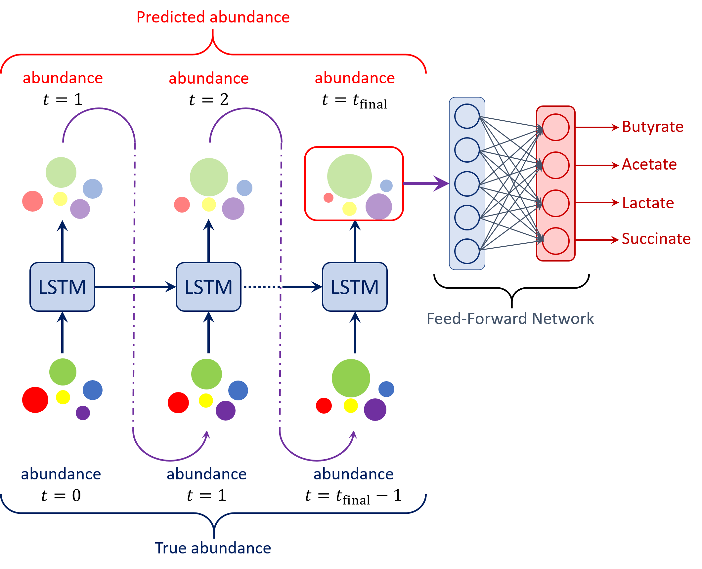

# Microbiome
PyTorch Implementation of the LSTM-based dynamical model for the paper titled "Deep Learning enables Design of Multifunctional Synthetic Human Gut Microbiome Dynamics"

### Requirements
* PyTorch
* scikit-learn
* LIME
* Jupyter Notebook
* MATLAB

### Usage
We provide multiple notebook files, one each for each set of experiments. The notebooks are self-sufficient and various relevant details have been marked in the files themselves.

### Acknowledgements
This research was supported in part by funding from the Army Research Office (ARO) grant number W911NF1910269. RLC was supported in part by an NHGRI training grant to the Genomic Sciences Training Program (T32 HG002760).

### Contact
All code related correspondence must be directed to Mayank Baranwal (baranwal.mayank@tcs.com).
